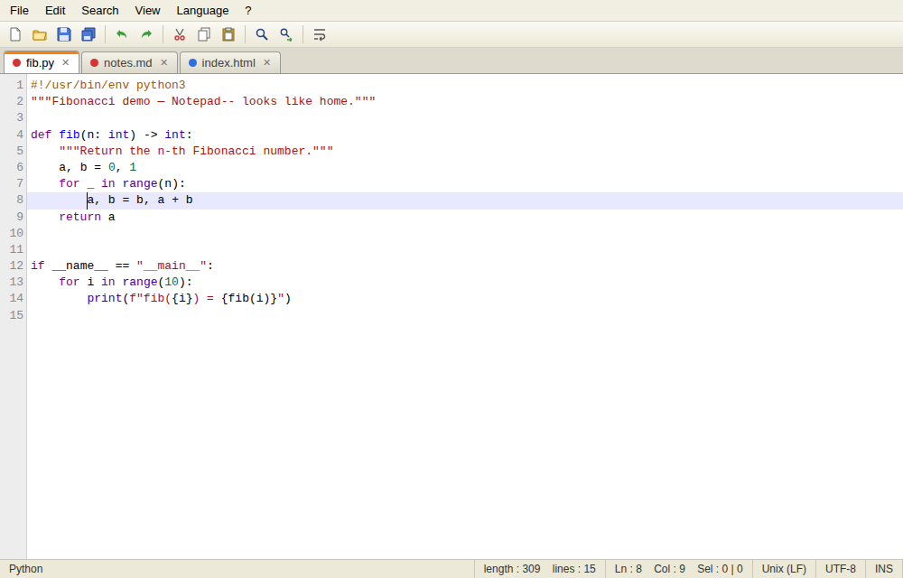

# Notepad--

**Notepad++ for the Mac** — an HTML interface wrapped in Python.

A lightweight, classic-Notepad++-style text editor. The UI is HTML/CSS/JS
(with [CodeMirror](https://codemirror.net/5/) for editing) rendered inside a
native macOS window via [pywebview](https://pywebview.flowrl.com/), which uses
the system WKWebView — so there's no bundled browser and the app stays small.



## Features

- **Tabs** — open many files at once; middle-click or ✕ to close; red/blue
  dot shows unsaved/saved state (like Notepad++'s floppy icons)
- **Session restore** — quit any time; your tabs *and unsaved text* come back
  exactly as you left them, Notepad++ style (stored in
  `~/Library/Application Support/Notepad--/session.json`)
- **Syntax highlighting** — Python, JavaScript, JSON, HTML, CSS, XML,
  Markdown, C/C++/Java, Shell, SQL, YAML; auto-detected by file extension,
  switchable from the Language menu
- **Find & Replace** — with match-case and **regular expressions**
  (including `$1` capture groups in replacements), live match highlighting
  and match counts, wrap-around search
- **The classics** — line numbers, word wrap toggle, go-to-line, zoom,
  current-line highlight, bracket matching, line/column/selection status bar,
  Windows/Unix line-ending detection (preserved on save)

## Run it (quick start)

```bash
pip3 install -r requirements.txt
python3 app.py
```

## Build a real Mac app

```bash
./build_app.sh
```

This produces `dist/Notepad--.app` — drag it into **Applications** and pin it
to your Dock. (Requires Python 3 from python.org or Homebrew; the script
installs `pyinstaller` automatically.)

## Keyboard shortcuts

| Action | Shortcut |
|---|---|
| New / Open / Save / Save As | ⌘N / ⌘O / ⌘S / ⇧⌘S |
| Close tab | ⌘W |
| Find / Replace | ⌘F / ⌥⌘F |
| Find next / previous | ⌘G / ⇧⌘G |
| Go to line | ⌘L |
| Zoom in / out / reset | ⌘+ / ⌘− / ⌘0 |

> Note: because unsaved text is always preserved in the session, closing the
> window never loses work — just like Notepad++.

## Project layout

```
app.py            # Python shell: native window, file dialogs, disk I/O, session
ui/index.html     # the interface
ui/css/style.css  # classic Notepad++ styling
ui/js/app.js      # tabs, find/replace, menus, session logic
ui/vendor/        # CodeMirror 5 (vendored, no network needed)
build_app.sh      # makes dist/Notepad--.app with PyInstaller
```

`ui/index.html` also runs in a plain browser (demo mode with limited file
access) — handy for UI development.
